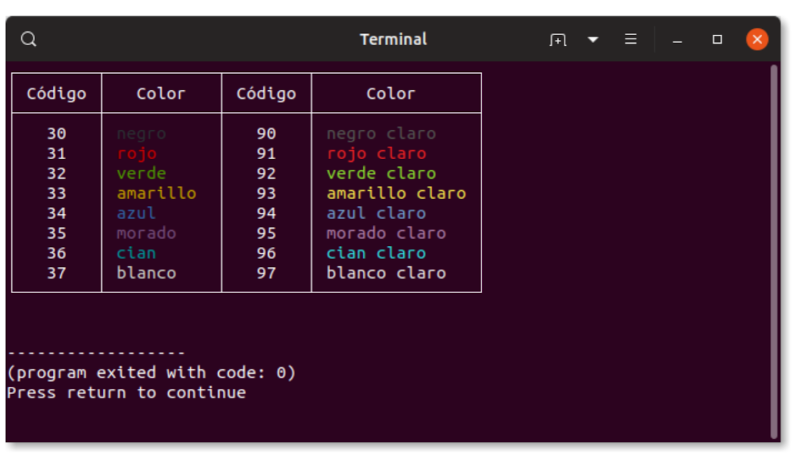

# Ejercicios de Repaso 30 días

***Ej0. El programa muestra una tabla por consola con los códigos de color disponibles. Usando la plantilla \033[XXm, basta cambiar XX por código correspondiente al color deseado. Estos códigos están establecidos en el estándar ANSI***

***Ej1. Realiza un programa que muestre tu nombre por pantalla.***

***Ej2. Realiza un programa que pida al usuario un valor en euros y escriba su valor en pesetas (un euro son 166'386 pesetas). Mejóralo para que el usuario pueda introducir el valor en euros o en pesetas, y el programa devuelva el valor en la moneda contraria.***

***Ej3. Realiza un programa que pida un número entero al usuario y escriba por pantalla su valor absoluto.***

***Ej4. Realiza un programa que pida al usuario un valor en euros y escriba su valor en pesetas (un euro son 166'386 pesetas). Mejóralo para que el usuario pueda introducir el valor en euros o en pesetas, y el programa devuelva el valor en la moneda contraria.***

***Ej5. Realiza un programa que lea tres longitudes y diga si tres segmentos con esas longitudes pueden formar un triángulo.***

***Ej6. Escribe un programa que lea un número N positivo y mayor que 0 por teclado y escriba la suma 1 + 2 + ... + N.***

***Ej7. Escribe un programa que declare variables de tipo `char` y de tipo `String`. Intenta mostrarlas por pantalla todas juntas en la misma línea y con una sola sentencia de Java (con un solo println) ¿es posible?.***

***Ej8. Escribe un programa que declare 5 variables de tipo `char`. A continuación, crea otra variable como cadena de caracteres y asígnale como valor la concatenación de las anteriores 5 variables. Por último, muestra la cadena de caracteres por pantalla. ¿Qué problemas te encuentras? ¿cómo lo has solucionado?***

***Ej9. Escribe un programa que calcule el área de un rectángulo. Hay que pedir datos al usuario***

***Ej10. Escribe un programa que calcule el área de un triángulo. Hay que pedir datos al usuario***

***Ej11. Escribe un programa que calcule el volumen de un cono. Hay que pedir datos al usuario***

***Ej12. Realiza un conversor de Mb a Kb y de Kb a Mb. Pista: Puedes hacer un menú***

***Ej13. Realiza un programa que pida por teclado un día de la semana y diga qué asignatura toca a primera hora ese día***

***Ej14. Realiza un programa que pida una hora por teclado y muestre buenos días, tardes o noches según la hora. Tramos de 6-12, 13-20 y 21-5***

***Ej15. Realiza un programa que resuelva una ecuación de primer grado del tipo ax + b = 0***

***Ej16. Realiza un programa que calcule la media de tres notas introducidas por teclado***

***Ej16b. Amplía el programa anterior para que diga la nota del boletín (IN, SUD, BN, NT, SB, MH)***

