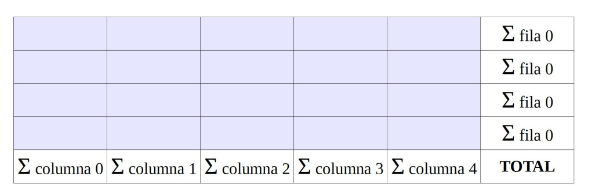

# Boletín 5: Ejercicios de Arrays Bidimensionales 🧩

## Ejercicio 1
Define un array de números enteros de 3 filas por 6 columnas con nombre `num` y asigna los valores según la siguiente tabla. Muestra el contenido de todos los elementos del array dispuestos en forma de tabla como se muestra en la figura.

## Ejercicio 2
Escribe un programa que pida 20 números enteros. Estos números se deben introducir en un array de 4 filas por 5 columnas. El programa mostrará las sumas parciales de filas y columnas igual que si de una hoja de cálculo se tratara. La suma total debe aparecer en la esquina inferior derecha.

## Ejercicio 3
Modifica el programa anterior de tal forma que los números que se introducen en el array se generen de forma aleatoria (valores entre 100 y 999).

## Ejercicio 4
Modifica el programa anterior de tal forma que las sumas parciales y la suma total aparezcan en la pantalla con un pequeño retardo, dando la impresión de que el ordenador se queda "pensando" antes de mostrar los números.

## Ejercicio 5
Realiza un programa que rellene un array de 6 filas por 10 columnas con números enteros positivos comprendidos entre 0 y 1000 (ambos incluidos). A continuación, el programa deberá dar la posición tanto del máximo como del mínimo.

## Ejercicio 6
Modifica el programa anterior de tal forma que no se repita ningún número en el array.

## Ejercicio 7
Mejora el juego "Busca el tesoro" de tal forma que si hay una mina a una casilla de distancia, el programa avise diciendo ¡Cuidado! ¡Hay una mina cerca!

## Ejercicio 8
Escribe un programa que, dada una posición en un tablero de ajedrez, nos diga a qué casillas podría saltar un alfil que se encuentra en esa posición. El alfil se mueve siempre en diagonal. El tablero cuenta con 64 casillas, donde las columnas se indican con las letras de la “a” a la “h” y las filas se indican del 1 al 8.

Ejemplo:

Introduzca la posición del alfil: d5
El álfil puede moverse a las siguientes posiciones:

h1 a2 g2 b3 f3 c4 e4 c6 e6 b7 f7 a8 g8
## Ejercicio 9
Realiza un programa que sea capaz de rotar todos los elementos de una matriz cuadrada una posición en el sentido de las agujas del reloj. La matriz debe tener 12 filas por 12 columnas y debe contener números generados al azar entre 0 y 100. Se debe mostrar tanto la matriz original como la matriz resultado, ambas con los números convenientemente alineados.

## Ejercicio 10
Realiza el juego de las tres en raya.

## Ejercicio 11
Realiza un programa que muestre por pantalla un array de 10 filas por 10
columnas relleno con números aleatorios entre 200 y 300. A continuación, el
programa debe mostrar los números de la diagonal que va desde la esquina
superior izquierda a la esquina inferior derecha, así como el máximo, el mínimo
y la media de los números que hay en esa diagonal.

## Ejercicio 12
Realiza un programa que muestre por pantalla un array de 9 filas por 9
columnas relleno con números aleatorios entre 500 y 900. A continuación, el
programa debe mostrar los números de la diagonal que va desde la esquina
inferior izquierda a la esquina superior derecha, así como el máximo, el mínimo
y la media de los números que hay en esa diagonal.
