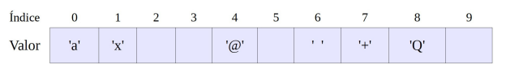

# Boletín 5: Arrays de una Dimensión 📊

## Ejercicio 1

Define un array de 12 números enteros con nombre `num` y asigna los valores según la tabla que se muestra a continuación. Muestra el contenido de todos los elementos del array. ¿Qué sucede con los valores de los elementos que no han sido inicializados?

## Ejercicio 2

Define un array de 10 caracteres con nombre `simbolo` y asigna valores a los elementos según la tabla que se muestra a continuación. Muestra el contenido de todos los elementos del array. ¿Qué sucede con los valores de los elementos que no han sido inicializados?

## Ejercicio 3

Escribe un programa que lea 10 números por teclado y que luego los muestre en orden inverso, es decir, el primero que se introduce es el último en mostrarse y viceversa.

## Ejercicio 4

Define tres arrays de 20 números enteros cada una, con nombres `numero`, `cuadrado` y `cubo`. Carga el array `numero` con valores aleatorios entre 0 y 100. En el array `cuadrado` se deben almacenar los cuadrados de los valores que hay en el array `numero`. En el array `cubo` se deben almacenar los cubos de los valores que hay en `numero`. A continuación, muestra el contenido de los tres arrays dispuesto en tres columnas.

## Ejercicio 5

Escribe un programa que pida 10 números por teclado y que luego muestre los números introducidos junto con las palabras “máximo” y “mínimo” al lado del máximo y del mínimo respectivamente.

## Ejercicio 6

Escribe un programa que lea 15 números por teclado y que los almacene en un array. Rota los elementos de ese array, es decir, el elemento de la posición 0 debe pasar a la posición 1, el de la 1 a la 2, etc. El número que se encuentra en la última posición debe pasar a la posición 0. Finalmente, muestra el contenido del array.

## Ejercicio 7

Escribe un programa que genere 100 números aleatorios del 0 al 20 y que los muestre por pantalla separados por espacios. El programa pedirá entonces por teclado dos valores y a continuación cambiará todas las ocurrencias del primer valor por el segundo en la lista generada anteriormente. Los números que se han cambiado deben aparecer entrecomillados.

## Ejercicio 8

Realiza un programa que pida la temperatura media que ha hecho en cada mes de un determinado año y que muestre a continuación un diagrama de barras horizontales con esos datos. Las barras del diagrama se pueden dibujar a base de asteriscos o cualquier otro carácter.

## Ejercicio 9

Realiza un programa que pida 8 números enteros y que luego muestre esos números junto con la palabra “par” o “impar” según proceda.

## Ejercicio 10

Escribe un programa que genere 20 números enteros aleatorios entre 0 y 100 y que los almacene en un array. El programa debe ser capaz de pasar todos los números pares a las primeras posiciones del array (del 0 en adelante) y todos los números impares a las celdas restantes. Utiliza arrays auxiliares si es necesario.

## Ejercicio 11

Realiza un programa que pida 10 números por teclado y que los almacene en un array. A continuación se mostrará el contenido de ese array junto al índice(0 – 9) utilizando para ello una tabla. Seguidamente el programa pasará los primos a las primeras posiciones, desplazando el resto de números (los que no son primos) de tal forma que no se pierda ninguno. Al final se debe mostrar el array resultante.

## Ejercicio 12

Realiza un programa que pida 10 números por teclado y que los almacene en un array. A continuación se mostrará el contenido de ese array junto al índice (0 – 9). Seguidamente el programa pedirá dos posiciones a las que llamaremos “inicial” y “final”. Se debe comprobar que inicial es menor que final y que ambos números están entre 0 y 9. El programa deberá colocar el número de la posición inicial en la posición final, rotando el resto de números para que no se pierda ninguno. Al final se debe mostrar el array resultante.
Por ejemplo, para inicial = 3 y final = 7:

## Ejercicio 13

Escribe un programa que rellene un array de 100 elementos con números enteros aleatorios comprendidos entre 0 y 500 (ambos incluidos). A continuación el programa mostrará el array y preguntará si el usuario quiere destacar el máximo o el mínimo. Seguidamente se volverá a mostrar el array escribiendo el número destacado entre dobles asteriscos.

Ejemplo:

459 204 20 250 178 90 353 32 229 357 224 454 260 310 140 249 332 426 423 413 96
447 465 298 459 411 118 480 302 417 42 82 126 82 474 362 76 190 104 21 257 88 21
251 6 383 47 78 392 394 244 494 87 253 376 379 98 364 237 13 299 228 409 402 225
426 267 330 243 209 426 435 309 356 173 130 416 15 477 34 28 377 193 481 368 466
262 422 275 384 399 397 87 218 84 312 480 207 68 108

¿Qué quiere destacar? (1 – mínimo, 2 – máximo): 1

459 204 20 250 178 90 353 32 229 357 224 454 260 310 140 249 332 426 423 413 96
447 465 298 459 411 118 480 302 417 42 82 126 82 474 362 76 190 104 21 257 88 21
251 **6** 383 47 78 392 394 244 494 87 253 376 379 98 364 237 13 299 228 409 402
225 426 267 330 243 209 426 435 309 356 173 130 416 15 477 34 28 377 193 481 368
466 262 422 275 384 399 397 87 218 84 312 480 207 68 108

## Ejercicio 14

Escribe un programa que pida 8 palabras y las almacene en un array. A continuación, las palabras correspondientes a colores se deben almacenar al comienzo y las que no son colores a continuación. Puedes utilizar tantos arrays auxiliares como quieras. Los colores que conoce el programa deben estar en otro array y son los siguientes: verde, rojo, azul, amarillo, naranja, rosa, negro, blanco y morado.

Ejemplo:
Array original:

┌────────┬────────┬────────┬────────┬────────┬────────┬────────┬────────┐
│ 0      │    1   │     2  │    3   │   4    │    5   │    6   │     7  │                             
├────────┼────────┼────────┼────────┼────────┼────────┼────────┼────────┤
│casa    │azul    │verde   │  orden │ morado │bombilla│  bici  │   rosa │
└────────┴────────┴────────┴────────┴────────┴────────┴────────┴────────┘
Array resultado:
┌────────┬────────┬────────┬────────┬────────┬────────┬────────┬────────┐
│ 0      │    1   │     2  │    3   │   4    │    5   │    6   │     7  │                             
├────────┼────────┼────────┼────────┼────────┼────────┼────────┼────────┤
│azul    │verde   │morado │  rosa │ casa     │orden   │bombilla│   bici │
└────────┴────────┴────────┴────────┴────────┴────────┴────────┴────────┘

## Ejercicio 15

Un restaurante nos ha encargado una aplicación para colocar a los clientes en sus mesas. En una mesa se pueden sentar de 0 (mesa vacía) a 4 comensales(mesa llena). Cuando llega un cliente se le pregunta cuántos son. De momento el programa no está preparado para colocar a grupos mayores a 4, por tanto, si un cliente dice por ejemplo que son un grupo de 6, el programa dará el mensaje
“Lo siento, no admitimos grupos de 6, haga grupos de 4 personas
como máximo e intente de nuevo”. Para el grupo que llega, se busca
siempre la primera mesa libre (con 0 personas). Si no quedan mesas libres, se
busca donde haya un hueco para todo el grupo, por ejemplo si el grupo es de
dos personas, se podrá colocar donde haya una o dos personas. Inicialmente,
las mesas se cargan con valores aleatorios entre 0 y 4. Cada vez que se sientan
nuevos clientes se debe mostrar el estado de las mesas. Los grupos no se
pueden romper aunque haya huecos sueltos suficientes. El funcionamiento del
programa se ilustra a continuación:
┌─────────┬────┬────┬────┬────┬────┬────┬────┬────┬────┬────┐
│Mesa nº  │ 1  │ 2  │ 3  │  4 │ 5  │ 6  │ 7  │ 8  │  9 │  10│
├─────────┼────┼────┼────┼────┼────┼────┼────┼────┼────┼────┤
│Ocupación│ 3  │ 2  │ 0  │  2 │ 4  │ 1  │ 0  │ 2  │  1 │  1 │
└─────────┴────┴────┴────┴────┴────┴────┴────┴────┴────┴────┘
¿Cuántos son? (Introduzca -1 para salir del programa): 2
Por favor, siéntense en la mesa número 3.

┌─────────┬────┬────┬────┬────┬────┬────┬────┬────┬────┬────┐
│Mesa nº  │ 1  │ 2  │ 3  │  4 │ 5  │ 6  │ 7  │ 8  │  9 │  10│
├─────────┼────┼────┼────┼────┼────┼────┼────┼────┼────┼────┤
│Ocupación│ 3  │ 2  │ 2  │  2 │ 4  │ 1  │ 0  │ 2  │  1 │  1 │
└─────────┴────┴────┴────┴────┴────┴────┴────┴────┴────┴────┘

## Ejercicio 16

Escribe un programa que rellene un array de 20 elementos con números enteros aleatorios comprendidos entre 0 y 400 (ambos incluidos). A continuación el programa mostrará el array y preguntará si el usuario quiere resaltar los múltiplos de 5 o los múltiplos de 7. Seguidamente se volverá a mostrar el array escribiendo los números que se quieren resaltar entre corchetes.

Ejemplo:

159 204 20 250 178 90 353 32 229 357 224 54 260 310 140 249 335 326 223 13

¿Qué números quiere resaltar? (1 – los múltiplos de 5, 2 – los múltiplos de 7): 1

159 204 [20] [250] 178 [90] 353 32 229 357 224 54 [260] [310] [140] 249 [335] 326 223 13

## Ejercicio 17

Escribe un programa que muestre por pantalla un array de 10 números enteros
generados al azar entre 0 y 100. A continuación, el programa debe pedir un
número al usuario. Se debe comprobar que el número introducido por teclado
se encuentra dentro del array, en caso contrario se mostrará un mensaje por
pantalla y se volverá a pedir un número; así hasta que el usuario introduzca uno
correctamente. A continuación, el programa rotará el array hacia la derecha
las veces que haga falta hasta que el número introducido quede situado en la
posición 0 del array. Por último, se mostrará el array rotado por pantalla.